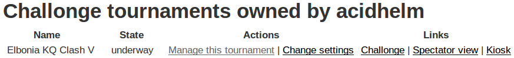
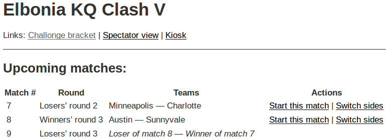
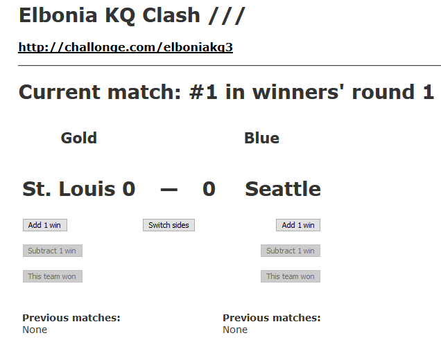
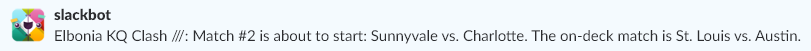

# Challonge Mgr

Challonge Mgr is a Rails app that uses the Challonge API to update your Killer
Queen tournament's bracket.  While you can update your bracket on Challonge
directly, the UI can be a bit fiddly, some controls are small, and common
tasks take several clicks.  My experience has been that unless there is a
person dedicated to maintaining the bracket, the bracket tends to be forgotten
about, which creates a worse viewing experience for folks who want to
follow the progress of the tournament.

Challonge Mgr makes it super easy to update your bracket.  The actions that
you need to do&nbsp;&mdash; start a match, update the score, and end a
match&nbsp;&mdash; can all be done with one click.  Challonge Mgr also shows
other info, like the list of upcoming matches, which is useful for your commentators.

Challonge Mgr can also send notifications to a Slack channel.  That lets viewers
see the results of matches, even if they're not watching the stream.  Players
can also watch the channel to see when their match is coming up.

# Setting up Challonge Mgr

You can run Challonge Mgr on your computer or on a hosting service like
[Heroku](https://heroku.com).  Setup instructions are in the
[INSTALL file](https://github.com/acidhelm/challonge_mgr/blob/master/INSTALL.md).
The rest of this readme assumes that you've followed those instructions.

# Create and manage a tournament

[Create your tournament](http://challonge.com/tournaments/new) on the Challonge
web site, then set up the teams and the bracket.  Be sure to click the "Start the
tournament" button on your tournament's Bracket settings page.

Open [the login page](http://localhost:3000/login) in a browser and enter the
user name and password for your Challonge Mgr account.  After you log in, you
will see your list of tournaments.

Click _Reload the tournament list from Challonge_ if your new tournament isn't
in the tournament list.  Click _Manage this tournament_ next to the tournament
that you are running.

## Update matches

When a match is about to start, click the _Start this match_ link next to it.
Challonge Mgr will show this match in the "Current match" section of the page.

When a team wins a game, click the _+1_ button under that team's name.
If you mistakenly add a win for the wrong team, click the _-1_
button to correct the score.  Click the _Switch sides_ button to swap the teams
between cabinets.

When a match is complete, click the _Match winner_ button under the winning
team's name.  The page will refresh and the match will appear in the "Completed
matches" section.

## Tournament settings

You can change the order of the cabinets and configure Slack notifications
by clicking the _Change settings_ link at the bottom of the match listing.

The order of the cabinets is set by the _The Gold cabinet is on the left side_
check box.  You can set the default value for this option by changing the
value of `config.gold_on_left_default` in the `config/applcation.rb` file.
If you set that value to match your cabinets, then you shouldn't have to toggle
this check box.

If you turn on Slack notifications and enter a channel name, Challonge Mgr will
post a message to the channel when a match begins and ends.  The notification
that's sent at the start of a match also says which teams are up next.  You
can tell your players to watch the channel to help them know when their turn
is coming up.

# Features for spectators and commentators

Challonge Mgr also provides a read-only view of the match list.  Spectators
can go to `/view/<tournament_id>` to see the list.  For example,
`/view/elboniakq1` shows the progress of
[the "elboniakq1" tournament](http://challonge.com/elboniakq1).

This view is also useful for your commentators, since it gives them an easy-to-read
list of the upcoming matches, and the match history of the teams that are in the
current match.

There is also a kiosk mode, which you can have up on another screen so players
can see which teams will be playing soon.  Go to the `/kiosk/<tournament_id>`
URL to see the kiosk, which shows the teams in the current match and the next two
upcoming matches.

The kiosk view automatically refreshes itself.  You can set how often it refreshes
with the `Rails.configuration.kiosk_refresh_time` config variable.  You can also
override that value by passing the time in seconds in the URL, for example
`/kiosk/<tournament_id>?t=30`.

# Features for streams

If you use Xsplit for broadcasting, Challonge Mgr can automatically update the
team names in your video.  The `/view/<tournament_id>/gold` and
`/view/<tournament_id>/blue` URLs return the name of the team that is
currently on that cabinet.  You can make your text labels get their text from
those URLs, and the names will be updated when you start each match.  If there
is parenthesized text at the end of the name, it will be removed from the text
that these URLs return.  This lets you have a team name like "The Bee's Knees
(SF/PHX)" in Challonge, but the "(SF/PHX)" part won't appear in the stream, to
save space on the screen.

Similarly, each team's score can be retrieved from the
`/view/<tournament_id>/gold_score` and `/view/<tournament_id>/blue_score` URLs,
and the names of the on-deck teams can be retrieved from the
`/view/<tournament_id>/on_deck_gold` and `/view/<tournament_id>/on_deck_blue` URLs.

After a match finishes, those URLs return the team names and scores from the
just-completed match, so your stream will continue to show those values until
the next match begins.  You can see this feature in action in
[the GDC 3 tournament video](https://www.youtube.com/watch?v=pF2hH9CPWGc&t=2h50m17s).
Notice how both team names switch at the same time to show the teams in the next
match, and that the scores reset to 0.

If your streaming software can't poll a URL, you can run a script on the streaming
computer that downloads the team names to text files, then set your streaming
software to read those files.  The `scripts` directory contains scripts for doing
this.  Currently, that directory has a PowerShell script.  You'll need to change
two strings in the script before you run it; see the TODO comments in the file 
for instructions.
