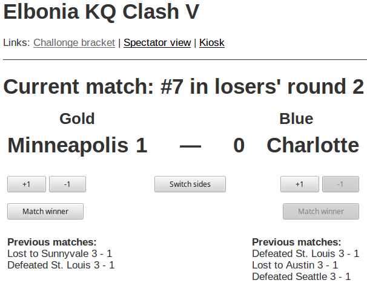

# Challonge Mgr

Challonge Mgr is a Rails app that uses the Challonge API to update your Killer
Queen tournament's bracket.  While you can update your bracket on Challonge
directly, the UI can be a bit fiddly, some controls are small, and common
tasks take several clicks.  My experience has been that unless there is a
person dedicated to maintaining the bracket, the bracket tends to be forgotten
about, which creates a worse viewing experience for folks who want to
follow the progress of the tournament.

Challonge Mgr makes it super-easy to update your bracket.  The actions that
you need to do&nbsp;&mdash; start a match, update the score, and end a
match&nbsp;&mdash; can all be done with one click.  Challonge Mgr also shows
other info, like the list of upcoming matches, which is useful for your commentators.

Challonge Mgr can also send notifications to a Slack channel.  That lets viewers
see the results of matches, even if they're not watching the stream.  Players
can also watch the channel to see when their match is coming up.

# Getting started

If you want to run Challonge Mgr on your computer, or do development on it,
follow the instructions in this section.  Instructions for running it on Heroku
are provided later on.

Clone the repo and set up gems and the initial database:

```sh
$ git clone https://github.com/acidhelm/challonge_mgr.git
$ cd challonge_mgr
$ bundle install --path vendor/bundle
$ bin/rails db:schema:load
```

There are two configuration keys that you will need to set, but you'll only have
to do this once.  In the `challonge_mgr` directory, run:

```sh
$ ruby -e 'require "securerandom"; puts "ATTR_ENCRYPTED_KEY=#{SecureRandom.hex 16}"' > .env
```

That creates an encryption key that only works on your computer.  You should not
copy that key to any other computer; generate a new key if you start using
Challonge Mgr on another computer.

The other key is for the Slack API.  If you don't plan on sending tournament
updates to Slack, you can skip this step.

Open the `.env` file in a text editor, and add this line:

```
SLACK_TOKEN=[the API token]
```

Use a key from Slackbot in [the team's custom integrations
page](https://kqchat.slack.com/apps/manage/custom-integrations).  The token is
the string after "token=" in the URL.


Then run the Rails server:

```sh
$ bin/rails server
```

## Create your Challonge Mgr account

Challonge Mgr accounts are used to hold your Challonge login information.  You
will need your Challonge API key, which you can find in
[your account settings](https://challonge.com/settings/developer).

There is no UI for creating accounts, but you can make an account in the Rails
console.  Run the console:

```sh
$ bin/rails console
```

Then run this command to make an account:

```ruby
> User.create user_name: "Your Challonge user name",
              api_key: "Your API key",
              password: "A password"
```

The password that you set here will be used to log in to Challonge Mgr.  It does
not have to be the same as your Challonge password.

If your user belongs to an organization that has a subdomain on challonge.com,
add a `subdomain: "your-subdomain"` parameter to the `create` call.  This lets
you manage tournaments that are owned by other users in your organization.

You can change these settings later by clicking the _Edit this user's settings_
link in your list of tournaments.
              
## Log in

Open [the login page](http://localhost:3000/login) in a browser and enter the
user name and password that you just set.  After logging in, you will see your
list of tournaments.

## Running Challonge Mgr on Heroku

Challonge Mgr is ready to deploy to a Heroku app, so that the tournament info can
be viewed by anyone.  These instructions assume that you have created accounts
on Heroku and GitHub.  Challonge Mgr doesn't require any paid components, so you
can use a free Heroku account.

### Deploying to Heroku using the command line

To use command-line tools, you must install the
[Heroku CLI app](https://devcenter.heroku.com/articles/heroku-cli).  After you
clone the repo, run:

```sh
$ heroku create <heroku app name>
```

For example, run this command:

```sh
$ heroku create my-challonge-mgr
```

to create <tt>my-challonge-mgr.herokuapp.com</tt>.  Don't use this name, of
course; use a name that's related to your scene or organization.  `heroku
create` also creates a git remote with the default name of "heroku".  Then, push
the app to that remote:

```sh
$ git push heroku master
```

You'll see a bunch of output as the app is compiled and installed.  Next,
create the environment variables `ATTR_ENCRYPTED_KEY` and (if needed)
`SLACK_TOKEN`.  Instead of creating an `.env` file, you add those variables
to your Heroku app's configuration:

```sh
$ key=`ruby -e 'require "securerandom"; puts SecureRandom.hex(16)'`
$ heroku config:set ATTR_ENCRYPTED_KEY=$key
$ heroku config:set SLACK_TOKEN=[the Slack token]
```

Next, set up the database:

```sh
$ heroku run rails db:migrate
```

Run the Rails console:

```sh
$ heroku console
```

and create a Challonge Mgr account as described earlier.  You can then access
Challonge Mgr at https://your-app-name.herokuapp.com.

### Deploying to Heroku using a Web browser

On GitHub, fork the Challonge Mgr repo to make a copy of it in your GitHub account.
On your Heroku dashboard, click _New_&rarr;_Create new app_, and give it a name.
Click that app in the dashboard, then click _Deploy_.  In the _Deployment method_
section, click _GitHub_, then _Connect to GitHub_.  That will show a popup window
from GitHub asking you to allow Heroku to access your GitHub account.  Click the
_Authorize_ button.

The _Connect to GitHub_ page will now show your GitHub account and a search
field.  Enter the name of your forked repo and click _Search_.  Click _Connect_
next to your repo in the search results.

The page will have a new _Manual deploy_ section at the bottom.  Click _Deploy
branch_ to deploy the <tt>master</tt> branch to your Heroku app.  Once the
deployment is done, the page will say "Your app was successfully deployed." <tt>\o/</tt>

Click _Settings_, then in the top-right corner, click _More_&rarr;_Run console_.
Type "bash", then click _Run_.  Run the Ruby command to generate an encryption key
as described earlier, and copy the key.  Close the console.

Click _Reveal config vars_ and create an <tt>ATTR_ENCRYPTED_KEY</tt> variable.
Use the encryption key that you just created as the value for that variable.
Create <tt>SLACK_TOKEN</tt> too if you want to send Slack notifications.

Click _More_&rarr;_Run console_ again, and enter "rails db:migrate". When that
finishes, click _Run another command_ at the bottom of the window, and enter
"console".  Create a Challonge Mgr account as described earlier.  You can then
access Challonge Mgr at https://your-app-name.herokuapp.com.

# Create and manage a tournament

[Create your tournament](http://challonge.com/tournaments/new) on the Challonge
web site, then set up the teams and the bracket.  Be sure to click the "Start the
tournament" button on your tournament's Bracket settings page.


Back in the browser, click _Reload the tournament list from Challonge_ if your
new tournament isn't already in the tournament list.  Click _Manage this tournament_
next to the tournament that you are running.

## Update matches


When a match is about to start, click the _Start this match_ link next to it.
Challonge Mgr will show this match in the "Current match" section of the page.



When a team wins a game, click the _Add 1 win_ button under that team's name.
If you mistakenly add a win for the wrong team, click the _Subtract 1 win_
button to correct the score.  Click the _Switch sides_ button if the cabinets
that the teams are on is opposite of the order in which they are shown on the page.

When a match is complete, click the _This team won_ button under the winning
team's name.  The page will refresh and show the match in the "Completed
matches" section.

## Tournament settings

You can change the order of the cabinets and configure Slack notifications
by clicking the _Edit this tournament's settings_ link at the bottom of the
match listing.

The order of the cabinets is set by the _The Gold cabinet is on the left side_
check box.  You can set the default value for this option by changing the
value of `config.gold_on_left_default` in the `config/applcation.rb` file.
If you set that value to match your cabinets, then you shouldn't have to toggle
this check box.


If you turn on Slack notifications and enter a channel name, Challonge Mgr will
post a message to the channel when a match begins and ends.  The notification
that's sent at the start of a match also says which teams are up next.  You
can tell your players to watch the channel to help them know when their turn
is coming up.

# Features for spectators and commentators

Challonge Mgr also provides a read-only view of the match list.  Spectators
can go to `/view/<tournament_id>` to see the list.  For example,
`/view/elboniakq1` shows the progress of
[the "elboniakq1" tournament](http://challonge.com/elboniakq1).

This view is also useful for your commentators, since it gives them an easy-to-read
list of the upcoming matches, and the match history of the teams that are in the
current match.

# Features for streams

If you use Xsplit for broadcasting, Challonge Mgr can automatically update the
team names in your video.  The `/view/<tournament_id>/gold` and
`/view/<tournament_id>/blue` URLs return the name of the team that is
currently on that cabinet.  You can make your text labels get their text from
those URLs, and the names will be updated when you start each match.  If there
is parenthesized text at the end of the name, it will be removed from the text
that these URLs return.  This lets you have a team name like "The Bee's Knees
(SF/PHX)" in Challonge, but the "(SF/PHX)" part won't appear in the stream, to
save space on the screen.

Similarly, each team's score can be retrieved from the
`/view/<tournament_id>/gold_score` and `/view/<tournament_id>/blue_score` URLs.

After a match finishes, those URLs return the team names and scores from the
just-completed match, so your stream will continue to show those values until
the next match begins.  You can see this feature in action in
[the GDC 3 tournament video](https://www.youtube.com/watch?v=pF2hH9CPWGc&t=2h50m17s).
Notice how both team names switch at the same time to show the teams in the next
match, and that the scores reset to 0.

If your streaming software can't poll a URL, you can run a script on the streaming
computer that downloads the team names to text files, then set your streaming
software to read those files.  The `scripts` directory contains scripts for doing
this.  Currently, that directory has a PowerShell script.  You'll need to change
two strings in the script before you run it; see the TODO comments in the file 
for instructions.

# Known problems

When you start a match, the bracket on Challonge does not indicate that the
match is in progress.  The Challonge API does not provide a way to mark a match
as being in progress, so I cannot fix this problem.  You will need to manually
mark matches as being in progress for now.  You should add a comment to
[this feedback page](http://feedback.challonge.com/forums/44455-feature-requests/suggestions/11251128-api-support-to-mark-an-match-in-progress)
if you would like this to be fixed.
